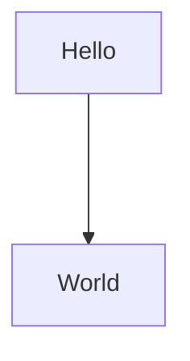

So far, everything we have looked at involved just one class. But if we were to do everything in just one class
that won't be very [SOLID](https://www.digitalocean.com/community/conceptual-articles/s-o-l-i-d-the-first-five-principles-of-object-oriented-design) of us.
<br/>And it's not just about following patterns, it's not even practical or friendly!

There are two ways you can talk to other classes. The first one is as old as OOP, simply create an instance
and call its methods.

The second, is more convenient based on the situation. Let's cover this first and then we can look at instantiating classes.

## Dependency Injection
Rather than you manually managing creation of classes, metz can do it for you.
We maintain a DI container to store a singleton instance of a classe. These instances can then be retreived using `std.resolve`.

Simply decorate the class with `@Injectable` and it will start participating in dependency injection.

Metz will put the class in a box, and you can take it out whenever or wherever you want.
Moreover, metz will take care of creating the entire dependency graph for you.

So to increase complexity for the sake of it, let's divide our hello world `Main` class [example](/classes) into two classes.

So it now looks like this:


You can use DI to make this representation easy:
```typescript
@Injectable
class Hello {
	/*
	* We are using std.resolve to get the singleton instance of 'World'
	* and make it our member.
	*/
	private worldInstance = std.resolve(World);

    hello() {
        const result = this.worldInstance.world('Hello');
        std.log(result);
    }
}

@Injectable
class World {

    world(arg: string) {
        return `${arg} World!`
    }
}
```
<Warning>Classes participating in DI can not have a constructor with uninitialized parameters.</Warning>

## Manual Construction

You can always use `new` to create instances manually, regardless if the class is part of DI container or not.

This is best suited for scenarios where you need multiple instances of the same thing. For example the `Poller` in [Introduction](/introduction)
needs to have 2 instances.
<br/>So we instantiated them using `new`, you can see this in the [code on playground](https://app.metz.sh/try?templateId=4) as well.

<br/>
You can see how the system behaves when the two approaches are used simulatenously.
<Frame>
    <iframe width="900px" height="600px" src="https://app.metz.sh/play/459ba1b42fa746b58f957b6c8f4603a6?minimal=true" />
</Frame>

<Tip>Creating instances on the fly is automatically handled when rendering!</Tip>

<br/>
We got multiple classes, but we are still stuck in a single file. Let's check out the next section to fix that.
