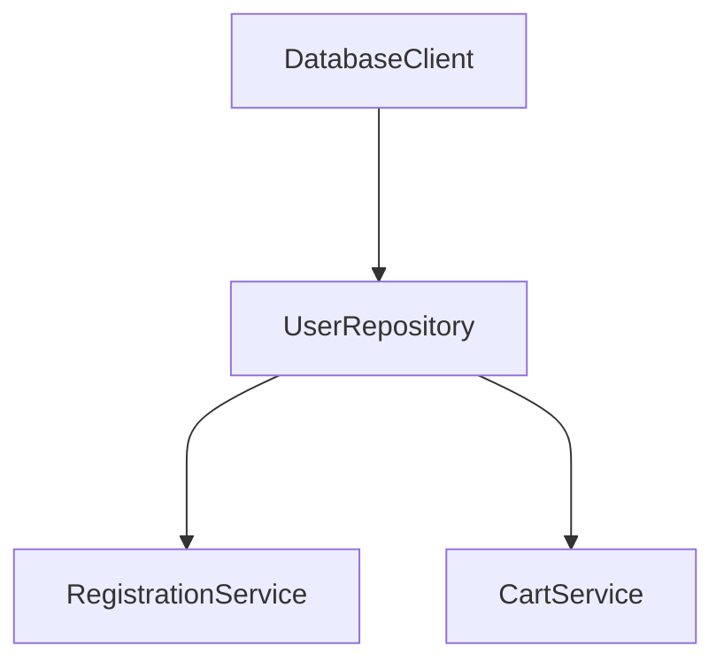

## Dependency Injection
Metz maintains a DI container to store singleton instances of classes. These instances can be retreived using `std.resolve` and classes
can participate in Dependency Injection if they are decorated with `@Injectable`.

<Warning>Classes participating in DI can not have a constructor with uninitialized parameters. [See this]()</Warning>

And because the DI container simply stores a singleton, this pattern comes handy when you don't want the overhead of managing things.
Metz will put the class in a box, and you can take it out whenever or wherever you want.
Moreover, metz will take care of creating the entire dependency graph for you.

So if you have a setup like:


You can use DI to make this representation easy:
```typescript
@Injectable
class DatabaseClient {
    // ... Doing some db stuff
}

@Injectable
class UserRepository {
    private readonly db = std.resolve(DatabaseClient);

    // ... Managing user entity
}

@Injectable
class RegistrationService {
    private readonly userRepository = std.resolve(UserRepository);

    // ... Can't manage users without acquiring them!
}

@Injectable
class CartService {
    private readonly userRepository = std.resolve(UserRepository);

    // ... Why acquire if they are not going to buy?
}
```

## Manual Construction

You can always use `new` to create instances manually, regardless if the class is part of DI container or not.

This is best suited for scenarios where you need multiple instances of the same thing. As we saw in the Load Balancer example in [Core Concepts](/core-concepts#class-based-system).

```typescript
@Injectable
class LoadBalancer {
  private servers = [
    new Server(),
    new Server()
  ];

  // ... rest of the LoadBalancer implementation
}
```