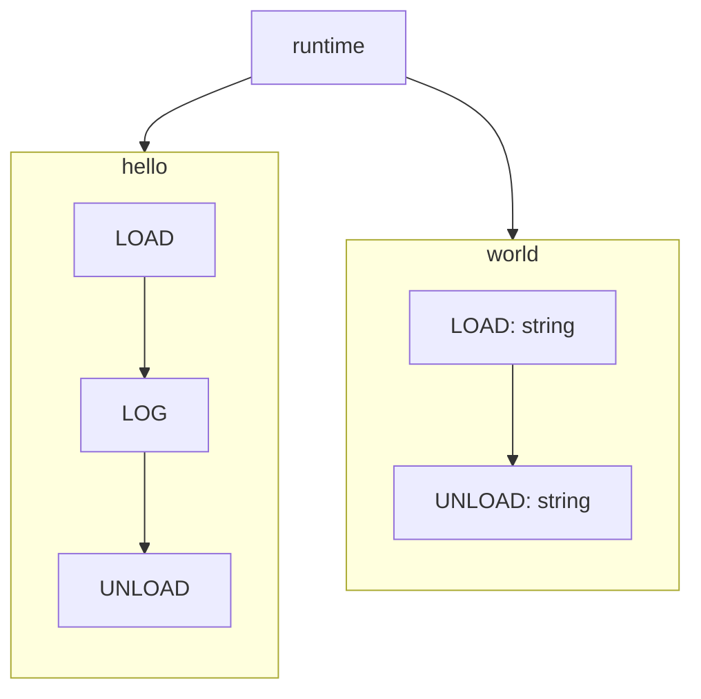

To understand the internals, we need to understand what the sequence of events are. What happens when
you press **'Build'**?

<Steps>
  <Step title="Compile">
    Your code, is sent to the web-worker running in background. It uses the typescript compiler
    and our [transformers](https://github.com/itsdouges/typescript-transformer-handbook) to convert your
    code into something that can be played and paused.

    Feel free to explore this in our [source code](https://github.com/metz-sh/simulacrum/tree/main/src/compiler)!
  </Step>
  <Step title="Glue">
    The runtime doesn't get bundled and compiled with your code.
    It exists separately, the compiled code simply calls to it.
    And to be able to do that, the compiled code is glued together with the runtime.

    Checkout [this code](https://github.com/metz-sh/simulacrum/blob/328eaf731a4b296e1e6101bb9e2444802a9f60f1/src/ui/services/bootloader/bootloader.service.ts#L22) in our repo for more clarity.
  </Step>
  <Step title="Run">
    As mentioned before in [Stories](/stories), nothing just runs. It's a story which gives your code
    the ability to run.
    So, your stories are rendered, each of them is given their own instance of runtime. And the story script is executed.

    Check out the relevant code [here](https://github.com/metz-sh/simulacrum/blob/328eaf731a4b296e1e6101bb9e2444802a9f60f1/src/ui/components/story-provider-factory/story-provider-factory.tsx#L42).
  </Step>
</Steps>

## The Instruction Set
Our compiler converts your code into something that can emit our instructions, or to be precise, can `yield` an instruction.

Sounds fancy, except our instructions are really simple:
```typescript
export enum MethodRuntimeCommands {
	LOAD = 'load',
	LOG = 'log',
	UNLOAD = 'unload',
	HALT = 'halt',
	NO_OP = 'no_op',
	AWAIT_FLOW = 'await_flow',
}
```

## State machines
Here's a more precise statement:

> Our compiler converts your code into state machines, where each instruction represents a state.
> <br/>And in turn, the runtime manages all these state machines and their transitions.

<Info>Check out the source code [here](https://github.com/metz-sh/simulacrum/blob/main/src/compiler/command-handlers/build-command/transformers/transform-call-expressions/method-body-parser.ts).</Info>

Take this code for example:
```typescript
class Main {
    /**
     * Is reponsible for many important things.
    */
    hello() {
        const result = this.world('Hello');
        std.log(result);
    }

    /**
     * Does all the heavy lifting!
    */
    world(arg: string) {
        return `${arg} World!`
    }
}
```
Here's a simplistic view of what it looks like after transformation:


<Note>Try thinking about [flows](/flows-101) and how they relate to a state-machine. <br/><br/>Hint: Complete overlap.</Note>

## Tick
We understand that our code gets boiled down to simple state machines,
and the runtime is responsible for managing state transitions.
<br/>But what does 'managing' mean?

The runtime maintains a number internally, called `currentTick`. It also has a function called `tick()` whose job is to get all the available state machines,
and make them transition, together.
<br/>When the combined transition of all the state machines is complete, `currentTick` is incremented. Here's the [code](https://github.com/metz-sh/simulacrum/blob/328eaf731a4b296e1e6101bb9e2444802a9f60f1/src/runtime/runtime.ts#L216) if you want to check it out.

## Time stands still
Unless a given state machine is transitioned, it's just stuck in time, stuck in that state, preserving all its context. And the only way to change that
is if you press the **Play** or the **Next** button.

Which means the only unit of time that matters is the `tick`.

A funtion was loaded at `tick=1`, logged something at `tick=2` and returned a number at `tick=3`.
<br/>For how long did this function run? *3 ticks*.

Doesn't matter if the user spent 10 seconds reading the log and 10 more seconds just keeping the playground paused,
external time doesn't affect the runtime.

<video
  muted
  playsInline
  controls
  className="w-full aspect-video"
  src="/videos/tick.mp4"
></video>

# Conclusion
We have established that `tick` is the only unit of time in metz, and it moves forward only when you ask it to.
<br/>You can have flows, that begin after certain ticks are passed, or flows that run every other tick.
<br/>You can also sleep for certain number of ticks.

**This gives you the ability to simulate scenarios that might be hard to do in real life. Especially the ones,
that involve time.**

Like what would happen if a service got hit with two requests for the same thing, at the same time.

The challenge lies in making this state possible. Without doing that, how can we even start to think about it?

Metz makes this a breeze, you are free to manipulate time however way you want. Halt a flow for a few ticks so that when
it resumes, it co-incides with some other flow. Or start a flow after certain ticks. Anything you want.

That's what made this example possible:
<Frame>
    <iframe width="900px" height="700px" src="https://app.metz.sh/play/0286b754d9e4408ba172e344eeac47b9" />
</Frame>
<Card horizontal title="Click here to open in a tab" icon="link" href="https://app.metz.sh/play/0286b754d9e4408ba172e344eeac47b9">
  Things might be squished here!
</Card>

<br/>
After this much lore dumping, it's natural to question, what was it all about? So before we go further, take a break, watch some [KRAZAM](https://youtu.be/DYvhC_RdIwQ?si=BA_jKSn4CukVP-YH), this doc will still be here.

And when you are back, we will re-visit flows in [Flows-102](/flows-102). A lot the learnings from this section will come handy!
